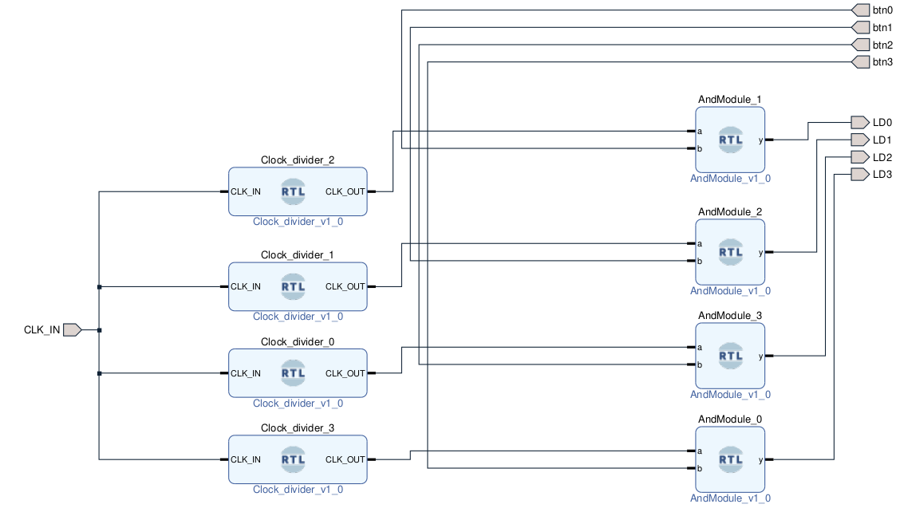

# Clock_divider_with_SW
## This is a simple project

Clock divider ANDed with switch

This project is a derivative of [A PYNQ-Z2 Guide for Absolute Dummies — Part III: Tick Tock, Using FPGA Clock by Umer Farooq](https://blog.umer-farooq.com/a-pynq-z2-guide-for-absolute-dummies-part-iii-tick-tock-using-fpga-clock-33a34ef3f51a)

This work is only for educational purpous and analyse the different aspects of PYNQ Z2
